<!--
  README.md – fortune-c GitHub Profile

  Layout
  ──────
  1. Animated typing banner (full width)
  2. ASCII portrait  |  Info card  (side by side)
  3. Tech stack SVG card  (Languages | Tools, full width)
  4. Contribution heatmap (full width)
  5. Streak stats    |  Top languages  (side by side)
  6. Spotify         |  Social badges  (side by side)
  7. Footer wave
-->

<!-- ── 1. Animated banner ─────────────────────────────────────────────────── -->

  

 

<!-- ── 2. ASCII portrait + Info card ─────────────────────────────────────── -->

  <table>
    <tr>
      <td valign="top" align="center">
        
      </td>
      <td valign="top" align="center">
        
      </td>
    </tr>
  </table>

 

<!-- ── 3. Tech stack (generated SVG card) ─────────────────────────────────── -->

  

 

<!-- ── 4. Contribution heatmap ─────────────────────────────────────────── -->

  

 

<!-- ── 5. GitHub stats ────────────────────────────────────────────────────── -->
<!--
  Streak stats use demolab.com which is stable and free.
  Top languages uses github-readme-stats – if the image breaks, self-deploy:
  https://vercel.com/new/clone?repository-url=https://github.com/anuraghazra/github-readme-stats&env=PAT_1
  Then replace "github-readme-stats.vercel.app" with your own Vercel URL.
-->

  <table>
    <tr>
      <td align="center">
        <picture>
          
        </picture>
      </td>
      <td align="center">
        <picture>
          
        </picture>
      </td>
    </tr>
  </table>

 

<!-- ── 6. Spotify + Social badges ─────────────────────────────────────────── -->
<!--
  To activate Spotify: deploy novatorem → https://github.com/novatorem/novatorem
  Then set spotify.vercel_url in config.yaml and update the src below.
  Until then the placeholder SVG is shown.
-->

  <table>
    <tr>
      <td align="center" valign="middle">
        
      </td>
      <td align="center" valign="middle">
        
        &nbsp;
        
          
        
      </td>
    </tr>
  </table>

 

<!-- ── Footer ─────────────────────────────────────────────────────────────── -->

  

