<!--
  README.md – fortune-c GitHub Profile

  Layout
  ──────
  1. Animated typing banner (full width)
  2. ASCII portrait  |  Info card  (side by side)
  3. Language / tool icon badges
  4. GitHub stats  |  Top languages  (side by side)
  5. Spotify now-playing
  6. Social badges
-->

<!-- ── 1. Animated banner ─────────────────────────────────────────────────── -->

  

 

<!-- ── 2. ASCII portrait + Info card ─────────────────────────────────────── -->

  <table>
    <tr>
      <td valign="top" align="center">
        
      </td>
      <td valign="top" align="center">
        
      </td>
    </tr>
  </table>

 

<!-- ── 3. Language & tool icon badges ────────────────────────────────────── -->

  <!-- Languages -->
  
  &nbsp;
  
  &nbsp;
  
  &nbsp;
  

  &nbsp;&nbsp;&nbsp;

  <!-- Editors & tools -->
  
  &nbsp;
  
  &nbsp;
  
  &nbsp;
  
  &nbsp;
  
  &nbsp;
  

 

<!-- ── 4. GitHub stats ────────────────────────────────────────────────────── -->
<!--
  Streak stats use demolab.com which is stable and free.
  Top languages uses github-readme-stats – if the image breaks, self-deploy:
  https://vercel.com/new/clone?repository-url=https://github.com/anuraghazra/github-readme-stats&env=PAT_1
  Then replace "github-readme-stats.vercel.app" with your own Vercel URL.
-->

  
  &nbsp;
  

 

<!-- ── 5. Spotify now-playing ─────────────────────────────────────────────── -->
<!--
  To activate: deploy novatorem → https://github.com/novatorem/novatorem
  Then set spotify.vercel_url in config.yaml and update the src below.
  Until then the placeholder SVG is shown.
-->

  

 

<!-- ── 6. Social badges ───────────────────────────────────────────────────── -->

  
  &nbsp;
  
  &nbsp;
  

