<!--
  README.md – fortune-c GitHub Profile

  Layout
  ──────
  1. Animated typing banner (full width)
  2. ASCII portrait  |  Info card  (side by side)
  3. Tech stack SVG card  (Languages | Tools, full width)
  4. Streak stats    |  Top languages  (side by side)
  5. Spotify         |  Social badges  (side by side)
  6. Footer wave
-->

<!-- ── 1. Animated banner ─────────────────────────────────────────────────── -->

  

 

<!-- ── 2. ASCII portrait + Info card ─────────────────────────────────────── -->

  <table>
    <tr>
      <td valign="top" align="center">
        
      </td>
      <td valign="top" align="center">
        
      </td>
    </tr>
  </table>

 

<!-- ── 3. Tech stack (generated SVG card) ─────────────────────────────────── -->

  

 

<!-- ── Footer ─────────────────────────────────────────────────────────────── -->

  

